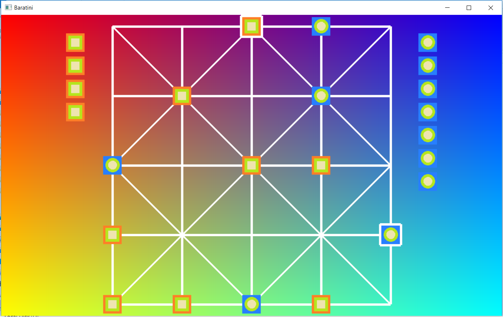

# 12-Pieces




## Prequisite
There is no external library needed as it is made from scratch.
For Windows just the Windows Native APIs i.e. Win32 and C++ (with Visual Compiler) is used.
For Linux just the X Window System APIs i.e. X11 and C++(with GCC Compiler) is used.

## Installation
There's no need to install the game. It is single executable file and can be played just click it.

## Building process
For Windows
```sh
build.bat
```
For Linux
```sh
build.sh
```
